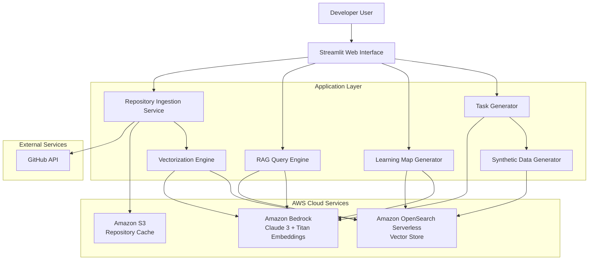

# Design Document: Dev-Drift

## Overview

Dev-Drift is an AI-powered codebase onboarding assistant that leverages Retrieval-Augmented Generation (RAG) to accelerate developer productivity when joining new projects. The system ingests GitHub repositories, creates semantic vector representations of code, generates interactive learning maps, and provides safe sandbox environments for hands-on practice.

The architecture follows enterprise cloud patterns with clear separation of concerns across ingestion, vectorization, retrieval, generation, and presentation layers. Amazon Bedrock provides the core generative AI capabilities (Claude 3 for reasoning, Titan for embeddings), while Amazon OpenSearch Serverless handles vector storage and similarity search. The Streamlit frontend provides an intuitive interface for developers to interact with the system.

### Key Design Principles

1. **Separation of Concerns**: Clear boundaries between ingestion, vectorization, retrieval, generation, and UI layers
2. **Cloud-Native Architecture**: Leverage managed AWS services (Bedrock, OpenSearch Serverless) for scalability and reliability
3. **RAG-First Approach**: All AI responses grounded in actual codebase context to minimize hallucinations
4. **Safety by Design**: Synthetic data generation and sandbox environments prevent production data exposure
5. **Incremental Processing**: Stream-based processing for large repositories to manage memory and provide progress feedback

## Architecture

### High-Level Architecture



### Component Interaction Flow

**Repository Onboarding Flow:**
1. User provides GitHub URL via Streamlit UI
2. Repository Ingestion Service clones repository and caches in S3
3. Vectorization Engine segments code into chunks
4. Vectorization Engine generates embeddings via Bedrock Titan
5. Embeddings stored in OpenSearch Serverless with metadata
6. Learning Map Generator analyzes dependencies and creates visualization

**Question Answering Flow:**
1. User submits question via Streamlit chat interface
2. RAG Query Engine converts question to embedding via Bedrock
3. Vector similarity search in OpenSearch retrieves relevant code chunks
4. RAG Query Engine constructs prompt with question + context
5. Bedrock Claude 3 generates answer grounded in retrieved context
6. Answer displayed with code citations and syntax highlighting

**Task Generation Flow:**
1. User requests starter tasks
2. Task Generator analyzes codebase structure via OpenSearch
3. Bedrock Claude 3 identifies safe, bounded coding opportunities
4. Synthetic Data Generator creates test data using SDV library
5. Task descriptions with sandbox setup instructions returned to user

## Components and Interfaces

### 1. Repository Ingestion Service

**Responsibility:** Fetch and prepare GitHub repositories for analysis.

**Key Methods:**

```python
class RepositoryIngestionService:
    def ingest_repository(self, github_url: str, auth_token: Optional[str] = None) -> RepositoryMetadata:
        """
        Clone and prepare a GitHub repository for processing.
        
        Args:
            github_url: GitHub repository URL (https or git format)
            auth_token: Optional GitHub personal access token for private repos
            
        Returns:
            RepositoryMetadata containing repo info and local path
            
        Raises:
            InvalidRepositoryError: If URL is invalid or repo inaccessible
            RepositorySizeError: If repository exceeds size limits
        """
        
    def extract_files(self, repo_path: str) -> List[SourceFile]:
        """
        Extract source code, documentation, and configuration files.
        
        Args:
            repo_path: Local path to cloned repository
            
        Returns:
            List of SourceFile objects with content and metadata
        """
        
    def filter_files(self, files: List[SourceFile]) -> List[SourceFile]:
        """
        Filter out binary files, dependencies, and build artifacts.
        
        Args:
            files: List of all extracted files
            
        Returns:
            Filtered list containing only relevant source files
        """
```

**Data Structures:**

```python
@dataclass
class RepositoryMetadata:
    name: str
    owner: str
    url: str
    primary_language: str
    size_bytes: int
    local_path: str
    ingestion_timestamp: datetime
    
@dataclass
class SourceFile:
    path: str
    content: str
    language: str
    size_bytes: int
    file_type: FileType  # SOURCE, DOCUMENTATION, CONFIG
```

**Dependencies:**
- PyGithub or GitHub REST API for repository access
- gitpython for cloning operations
- boto3 for S3 caching

### 2. Vectorization Engine

**Responsibility:** Convert code into semantic vector embeddings for similarity search.

**Key Methods:**

```python
class VectorizationEngine:
    def __init__(self, bedrock_client: BedrockClient, opensearch_client: OpenSearchClient):
        self.bedrock = bedrock_client
        self.opensearch = opensearch_client
        
    def segment_code(self, source_file: SourceFile) -> List[CodeChunk]:
        """
        Segment source code into logical chunks based on AST boundaries.
        
        Args:
            source_file: Source file to segment
            
        Returns:
            List of CodeChunk objects representing functions, classes, modules
        """
        
    def generate_embeddings(self, chunks: List[CodeChunk]) -> List[Embedding]:
        """
        Generate vector embeddings using Amazon Bedrock Titan.
        
        Args:
            chunks: List of code chunks to embed
            
        Returns:
            List of Embedding objects with vectors and metadata
        """
        
    def store_embeddings(self, embeddings: List[Embedding]) -> None:
        """
        Store embeddings in OpenSearch Serverless with k-NN indexing.
        
        Args:
            embeddings: List of embeddings to store
        """
        
    def vectorize_repository(self, files: List[SourceFile]) -> VectorizationResult:
        """
        Complete vectorization pipeline for a repository.
        
        Args:
            files: List of source files from repository
            
        Returns:
            VectorizationResult with statistics and any errors
        """
```

**Data Structures:**

```python
@dataclass
class CodeChunk:
    content: str
    file_path: str
    start_line: int
    end_line: int
    chunk_type: ChunkType  # FUNCTION, CLASS, MODULE, DOCUMENTATION
    language: str
    metadata: Dict[str, Any]  # function name, class name, etc.
    
@dataclass
class Embedding:
    vector: List[float]  # 1536-dimensional for Titan
    chunk: CodeChunk
    embedding_model: str
    
@dataclass
class VectorizationResult:
    total_chunks: int
    successful_embeddings: int
    failed_chunks: List[Tuple[CodeChunk, str]]  # chunk and error message
    processing_time_seconds: float
```

**Code Segmentation Strategy:**
- Use AST parsing (ast module for Python, tree-sitter for other languages)
- Segment boundaries: function definitions, class definitions, top-level module code
- Include docstrings and comments with code chunks
- Maximum chunk size: 512 tokens to fit embedding model limits
- Overlap: 50 tokens between adjacent chunks for context continuity

### 3. Learning Map Generator

**Responsibility:** Analyze codebase structure and create interactive learning visualizations.

**Key Methods:**

```python
class LearningMapGenerator:
    def __init__(self, opensearch_client: OpenSearchClient, bedrock_client: BedrockClient):
        self.opensearch = opensearch_client
        self.bedrock = bedrock_client
        
    def analyze_dependencies(self, repo_metadata: RepositoryMetadata) -> DependencyGraph:
        """
        Analyze import statements and module relationships.
        
        Args:
            repo_metadata: Repository metadata with local path
            
        Returns:
            DependencyGraph representing module relationships
        """
        
    def identify_core_components(self, dep_graph: DependencyGraph) -> List[CoreComponent]:
        """
        Identify entry points, core modules, and architectural layers.
        
        Args:
            dep_graph: Dependency graph from analysis
            
        Returns:
            List of CoreComponent objects with importance scores
        """
        
    def generate_component_descriptions(self, components: List[CoreComponent]) -> Dict[str, str]:
        """
        Use LLM to generate natural language descriptions for components.
        
        Args:
            components: List of core components
            
        Returns:
            Dictionary mapping component names to descriptions
        """
        
    def create_learning_path(self, components: List[CoreComponent]) -> LearningPath:
        """
        Generate optimal learning sequence from foundational to advanced.
        
        Args:
            components: List of core components with dependencies
            
        Returns:
            LearningPath with ordered component sequence and rationale
        """
        
    def generate_visualization(self, dep_graph: DependencyGraph, 
                              learning_path: LearningPath) -> VisualizationData:
        """
        Create interactive graph visualization data for Streamlit.
        
        Args:
            dep_graph: Dependency graph
            learning_path: Suggested learning sequence
            
        Returns:
            VisualizationData for rendering in UI
        """
```

**Data Structures:**

```python
@dataclass
class DependencyGraph:
    nodes: List[ModuleNode]
    edges: List[DependencyEdge]
    
@dataclass
class ModuleNode:
    name: str
    file_path: str
    node_type: NodeType  # ENTRY_POINT, CORE, UTILITY, TEST
    importance_score: float
    
@dataclass
class DependencyEdge:
    source: str  # module name
    target: str  # module name
    edge_type: EdgeType  # IMPORT, INHERITANCE, COMPOSITION
    
@dataclass
class CoreComponent:
    name: str
    description: str
    file_paths: List[str]
    dependencies: List[str]
    importance_score: float
    layer: ArchitecturalLayer  # PRESENTATION, BUSINESS, DATA, INFRASTRUCTURE
    
@dataclass
class LearningPath:
    ordered_components: List[CoreComponent]
    rationale: str
    estimated_time_hours: float
```

**Dependency Analysis Algorithm:**
1. Parse import statements from all source files
2. Build directed graph with modules as nodes, imports as edges
3. Calculate importance scores using PageRank algorithm
4. Identify entry points (files with `if __name__ == "__main__"` or main functions)
5. Classify modules into architectural layers based on naming and dependencies
6. Topologically sort components for learning path (dependencies before dependents)

### 4. RAG Query Engine

**Responsibility:** Answer developer questions using retrieval-augmented generation.

**Key Methods:**

```python
class RAGQueryEngine:
    def __init__(self, opensearch_client: OpenSearchClient, bedrock_client: BedrockClient):
        self.opensearch = opensearch_client
        self.bedrock = bedrock_client
        self.conversation_history: List[ConversationTurn] = []
        
    def process_question(self, question: str, repo_id: str) -> RAGResponse:
        """
        Process a natural language question about the codebase.
        
        Args:
            question: User's natural language question
            repo_id: Repository identifier for context
            
        Returns:
            RAGResponse with answer, citations, and confidence score
        """
        
    def embed_question(self, question: str) -> List[float]:
        """
        Convert question to embedding vector using Bedrock Titan.
        
        Args:
            question: Natural language question
            
        Returns:
            Embedding vector
        """
        
    def retrieve_context(self, question_embedding: List[float], 
                        repo_id: str, top_k: int = 5) -> List[RetrievedChunk]:
        """
        Perform vector similarity search to find relevant code chunks.
        
        Args:
            question_embedding: Question vector
            repo_id: Repository identifier
            top_k: Number of chunks to retrieve
            
        Returns:
            List of RetrievedChunk objects with relevance scores
        """
        
    def construct_prompt(self, question: str, 
                        context_chunks: List[RetrievedChunk]) -> str:
        """
        Build prompt for LLM with question and retrieved context.
        
        Args:
            question: Original question
            context_chunks: Retrieved code chunks
            
        Returns:
            Formatted prompt string
        """
        
    def generate_answer(self, prompt: str) -> LLMResponse:
        """
        Generate answer using Amazon Bedrock Claude 3.
        
        Args:
            prompt: Formatted prompt with question and context
            
        Returns:
            LLMResponse with generated answer
        """
        
    def extract_citations(self, answer: str, 
                         context_chunks: List[RetrievedChunk]) -> List[Citation]:
        """
        Extract file and line number citations from answer.
        
        Args:
            answer: Generated answer text
            context_chunks: Context used for generation
            
        Returns:
            List of Citation objects
        """
```

**Data Structures:**

```python
@dataclass
class RAGResponse:
    answer: str
    citations: List[Citation]
    confidence_score: float
    context_chunks: List[RetrievedChunk]
    processing_time_ms: int
    
@dataclass
class RetrievedChunk:
    chunk: CodeChunk
    relevance_score: float
    
@dataclass
class Citation:
    file_path: str
    start_line: int
    end_line: int
    snippet: str
    
@dataclass
class ConversationTurn:
    question: str
    answer: str
    timestamp: datetime
```

**RAG Prompt Template:**

```
You are an expert code assistant helping a developer understand a codebase. 
Answer the question based ONLY on the provided code context. If the context 
doesn't contain enough information, say so clearly.

QUESTION: {question}

CODE CONTEXT:
{context_chunk_1}
File: {file_path_1}, Lines: {start_line_1}-{end_line_1}

{context_chunk_2}
File: {file_path_2}, Lines: {start_line_2}-{end_line_2}

...

Provide a clear, concise answer with specific references to files and line numbers.
```

### 5. Task Generator

**Responsibility:** Generate safe starter tasks with sandbox environments.

**Key Methods:**

```python
class TaskGenerator:
    def __init__(self, opensearch_client: OpenSearchClient, 
                 bedrock_client: BedrockClient,
                 synth_data_gen: SyntheticDataGenerator):
        self.opensearch = opensearch_client
        self.bedrock = bedrock_client
        self.synth_data = synth_data_gen
        
    def identify_starter_tasks(self, repo_id: str) -> List[StarterTask]:
        """
        Analyze codebase to identify safe, bounded coding opportunities.
        
        Args:
            repo_id: Repository identifier
            
        Returns:
            List of StarterTask objects with descriptions and difficulty
        """
        
    def analyze_test_coverage(self, repo_metadata: RepositoryMetadata) -> CoverageReport:
        """
        Identify functions/classes lacking unit tests.
        
        Args:
            repo_metadata: Repository metadata
            
        Returns:
            CoverageReport with untested components
        """
        
    def generate_task_description(self, task_type: TaskType, 
                                  target_component: str) -> str:
        """
        Use LLM to generate detailed task description.
        
        Args:
            task_type: Type of task (TEST, REFACTOR, DOCUMENT, TYPE_HINT)
            target_component: Component to work on
            
        Returns:
            Detailed task description with acceptance criteria
        """
        
    def create_sandbox_environment(self, task: StarterTask) -> SandboxConfig:
        """
        Create sandbox configuration with synthetic data.
        
        Args:
            task: Starter task requiring sandbox
            
        Returns:
            SandboxConfig with setup instructions and test data
        """
```

**Data Structures:**

```python
@dataclass
class StarterTask:
    title: str
    description: str
    task_type: TaskType
    difficulty: Difficulty  # BEGINNER, INTERMEDIATE, ADVANCED
    affected_files: List[str]
    estimated_time_minutes: int
    acceptance_criteria: List[str]
    requires_sandbox: bool
    
@dataclass
class SandboxConfig:
    test_data_path: str
    environment_variables: Dict[str, str]
    setup_instructions: str
    validation_command: str
    
@dataclass
class CoverageReport:
    total_functions: int
    tested_functions: int
    untested_components: List[str]
    coverage_percentage: float
```

**Task Identification Strategy:**
1. **Test Coverage Analysis**: Parse test files, identify untested functions
2. **Documentation Gaps**: Find functions without docstrings
3. **Type Hint Opportunities**: Identify untyped function signatures (Python)
4. **Refactoring Candidates**: Find functions exceeding complexity thresholds (cyclomatic complexity > 10)
5. **Code Smell Detection**: Identify duplicated code, long functions, large classes

### 6. Synthetic Data Generator

**Responsibility:** Generate realistic test data using SDV library.

**Key Methods:**

```python
class SyntheticDataGenerator:
    def __init__(self):
        self.sdv_synthesizers: Dict[str, Any] = {}
        
    def infer_schema(self, data_sample: pd.DataFrame) -> DataSchema:
        """
        Infer data schema from sample production data or code analysis.
        
        Args:
            data_sample: Sample data or empty DataFrame with column types
            
        Returns:
            DataSchema describing data structure and constraints
        """
        
    def generate_synthetic_data(self, schema: DataSchema, 
                                num_rows: int = 1000) -> pd.DataFrame:
        """
        Generate synthetic data matching schema using SDV.
        
        Args:
            schema: Data schema to match
            num_rows: Number of rows to generate
            
        Returns:
            DataFrame with synthetic data
        """
        
    def validate_synthetic_data(self, synthetic_data: pd.DataFrame, 
                                schema: DataSchema) -> ValidationResult:
        """
        Validate that synthetic data matches schema constraints.
        
        Args:
            synthetic_data: Generated synthetic data
            schema: Expected schema
            
        Returns:
            ValidationResult with any constraint violations
        """
```

**Data Structures:**

```python
@dataclass
class DataSchema:
    table_name: str
    columns: List[ColumnSchema]
    constraints: List[Constraint]
    
@dataclass
class ColumnSchema:
    name: str
    data_type: str
    nullable: bool
    unique: bool
    
@dataclass
class Constraint:
    constraint_type: ConstraintType  # PRIMARY_KEY, FOREIGN_KEY, CHECK
    columns: List[str]
    details: Dict[str, Any]
```

### 7. Streamlit Web Interface

**Responsibility:** Provide intuitive web interface for user interactions.

**Key Pages:**

```python
# app.py - Main Streamlit application

def main():
    st.set_page_config(page_title="Dev-Drift", layout="wide")
    
    # Sidebar navigation
    page = st.sidebar.selectbox("Navigate", [
        "Repository Onboarding",
        "Learning Map",
        "Ask Questions",
        "Starter Tasks"
    ])
    
    if page == "Repository Onboarding":
        render_onboarding_page()
    elif page == "Learning Map":
        render_learning_map_page()
    elif page == "Ask Questions":
        render_qa_page()
    elif page == "Starter Tasks":
        render_tasks_page()

def render_onboarding_page():
    """Repository ingestion interface with progress tracking."""
    st.title("🚀 Onboard New Repository")
    
    github_url = st.text_input("GitHub Repository URL")
    auth_token = st.text_input("GitHub Token (optional)", type="password")
    
    if st.button("Start Onboarding"):
        with st.spinner("Cloning repository..."):
            # Call Repository Ingestion Service
            pass
        
        with st.spinner("Vectorizing code..."):
            # Call Vectorization Engine with progress bar
            progress_bar = st.progress(0)
            # Update progress_bar as files are processed
            pass
        
        st.success("Repository onboarded successfully!")

def render_learning_map_page():
    """Interactive learning map visualization."""
    st.title("📚 Learning Map")
    
    # Display interactive graph using streamlit-agraph or plotly
    # Show component descriptions on click
    # Highlight suggested learning path
    pass

def render_qa_page():
    """Chat interface for asking questions."""
    st.title("💬 Ask Questions")
    
    # Display conversation history
    for turn in st.session_state.conversation_history:
        st.chat_message("user").write(turn.question)
        st.chat_message("assistant").write(turn.answer)
        # Display code citations with syntax highlighting
    
    # Input for new question
    if question := st.chat_input("Ask about the codebase..."):
        # Call RAG Query Engine
        response = rag_engine.process_question(question, repo_id)
        # Display answer with citations
        pass

def render_tasks_page():
    """Starter tasks with sandbox setup."""
    st.title("✅ Starter Tasks")
    
    tasks = task_generator.identify_starter_tasks(repo_id)
    
    for task in tasks:
        with st.expander(f"{task.title} ({task.difficulty})"):
            st.write(task.description)
            st.write("**Affected Files:**")
            for file in task.affected_files:
                st.code(file)
            
            if task.requires_sandbox:
                if st.button(f"Setup Sandbox for {task.title}"):
                    sandbox = task_generator.create_sandbox_environment(task)
                    st.code(sandbox.setup_instructions, language="bash")
```

## Data Models

### OpenSearch Index Schema

```json
{
  "settings": {
    "index": {
      "knn": true,
      "knn.algo_param.ef_search": 512
    }
  },
  "mappings": {
    "properties": {
      "embedding": {
        "type": "knn_vector",
        "dimension": 1536,
        "method": {
          "name": "hnsw",
          "space_type": "cosinesimil",
          "engine": "nmslib",
          "parameters": {
            "ef_construction": 512,
            "m": 16
          }
        }
      },
      "repo_id": {
        "type": "keyword"
      },
      "file_path": {
        "type": "keyword"
      },
      "chunk_content": {
        "type": "text",
        "analyzer": "standard"
      },
      "start_line": {
        "type": "integer"
      },
      "end_line": {
        "type": "integer"
      },
      "chunk_type": {
        "type": "keyword"
      },
      "language": {
        "type": "keyword"
      },
      "metadata": {
        "type": "object",
        "enabled": true
      },
      "ingestion_timestamp": {
        "type": "date"
      }
    }
  }
}
```

### Repository Metadata Storage (S3)

```json
{
  "repo_id": "uuid-v4",
  "name": "example-repo",
  "owner": "github-user",
  "url": "https://github.com/github-user/example-repo",
  "primary_language": "Python",
  "size_bytes": 5242880,
  "local_path": "/tmp/repos/uuid-v4",
  "s3_cache_path": "s3://dev-drift-repos/uuid-v4",
  "ingestion_timestamp": "2024-01-15T10:30:00Z",
  "vectorization_status": "completed",
  "total_files": 150,
  "total_chunks": 1250,
  "learning_map_generated": true
}
```


## Correctness Properties

A property is a characteristic or behavior that should hold true across all valid executions of a system—essentially, a formal statement about what the system should do. Properties serve as the bridge between human-readable specifications and machine-verifiable correctness guarantees.

### Property Reflection

After analyzing all acceptance criteria, I identified several areas of redundancy:

1. **Retry Logic Properties (7.3, 11.1, 11.2)**: These all test exponential backoff retry behavior. Can be consolidated into a single comprehensive retry property.

2. **Error Resilience (2.6, 11.3)**: Both test that vectorization continues after file failures. These are duplicates.

3. **Metadata Completeness (1.6, 2.3)**: Both test that all required metadata fields are present after operations. Can be combined into a general metadata completeness property.

4. **Embedding Generation (2.2, 2.5)**: Property 2.2 tests that embeddings are generated, and 2.5 tests that they're all indexed. Property 2.5 subsumes 2.2.

5. **Task Completeness (6.3, 6.8)**: Both test that tasks contain all required fields including validation criteria. Can be combined.

The following properties represent the unique, non-redundant validation requirements after reflection.

### Core Functional Properties

**Property 1: Repository Cloning Success**

*For any* valid GitHub repository URL, cloning the repository should succeed and produce a local directory containing the repository contents.

**Validates: Requirements 1.1**

---

**Property 2: File Extraction Completeness**

*For any* cloned repository, extracting files should produce a list containing all source code, documentation, and configuration files present in the repository.

**Validates: Requirements 1.2**

---

**Property 3: File Filtering Correctness**

*For any* list of extracted files, filtering should remove all binary files, dependency directories (node_modules, venv, etc.), build artifacts, and .git directories, while preserving all source and documentation files.

**Validates: Requirements 1.3**

---

**Property 4: Invalid URL Error Handling**

*For any* invalid or inaccessible GitHub URL, the ingestion service should return a descriptive error message without crashing.

**Validates: Requirements 1.4**

---

**Property 5: Metadata Persistence Completeness**

*For any* successfully ingested repository, the persisted metadata should contain all required fields: name, owner, primary language, ingestion timestamp, file paths, and chunk types.

**Validates: Requirements 1.6, 2.3**

---

**Property 6: Code Segmentation Boundary Alignment**

*For any* source file, segmenting the code should produce chunks where each chunk boundary aligns with AST boundaries (function definitions, class definitions, or module-level code blocks).

**Validates: Requirements 2.1**

---

**Property 7: Embedding Indexing Completeness**

*For any* set of generated embeddings, the number of documents indexed in OpenSearch should equal the number of embeddings generated.

**Validates: Requirements 2.2, 2.5**

---

**Property 8: Documentation Structure Preservation**

*For any* documentation file, the generated embeddings should preserve the document's hierarchical structure (headings, sections, code blocks).

**Validates: Requirements 2.4**

---

**Property 9: Vectorization Error Resilience**

*For any* repository where some files fail to vectorize, the vectorization engine should log errors for failed files and successfully process all remaining files.

**Validates: Requirements 2.6, 11.3**

---

**Property 10: Dependency Graph Generation**

*For any* vectorized repository, dependency analysis should produce a directed graph where nodes represent modules and edges represent import relationships.

**Validates: Requirements 3.1**

---

**Property 11: Entry Point Identification**

*For any* repository with entry points (main functions, if __name__ == "__main__" blocks), the learning map generator should correctly identify all entry points.

**Validates: Requirements 3.2**

---

**Property 12: Component Description Completeness**

*For any* identified core component, the learning map should include a non-empty natural language description.

**Validates: Requirements 3.4**

---

**Property 13: Learning Path Dependency Ordering**

*For any* generated learning path, if component A depends on component B, then B should appear before A in the learning path sequence.

**Validates: Requirements 3.5**

---

**Property 14: Component Detail Completeness**

*For any* component in the learning map, the detail view should contain purpose description, list of dependencies, and list of key functions.

**Validates: Requirements 3.7**

---

**Property 15: Question Embedding Generation**

*For any* natural language question, the RAG query engine should generate a 1536-dimensional embedding vector.

**Validates: Requirements 4.1**

---

**Property 16: Vector Similarity Search Execution**

*For any* question embedding and repository, performing similarity search should return a non-empty list of code chunks with relevance scores.

**Validates: Requirements 4.2**

---

**Property 17: Result Ranking and Limiting**

*For any* set of retrieved chunks, the results should be ordered by descending relevance score and limited to the top 5 chunks.

**Validates: Requirements 4.3**

---

**Property 18: Prompt Construction Completeness**

*For any* question and set of retrieved chunks, the constructed prompt should contain both the original question text and the content of all retrieved chunks.

**Validates: Requirements 4.4**

---

**Property 19: LLM Response Generation**

*For any* constructed prompt, sending it to Amazon Bedrock Claude 3 should return a non-empty response.

**Validates: Requirements 4.5**

---

**Property 20: Citation Inclusion**

*For any* generated answer, the response should include citations containing file paths and line numbers for the source code referenced.

**Validates: Requirements 4.6**

---

**Property 21: Architectural Context Retrieval Diversity**

*For any* architectural explanation request, the retrieved context should include multiple file types (source code, configuration files, documentation).

**Validates: Requirements 5.1**

---

**Property 22: Starter Task Generation**

*For any* repository, requesting starter tasks should return a non-empty list of tasks.

**Validates: Requirements 6.1**

---

**Property 23: Task Type Appropriateness**

*For any* generated starter task, the task type should be one of: adding unit tests, refactoring functions, improving documentation, or adding type hints.

**Validates: Requirements 6.2**

---

**Property 24: Task Description Completeness**

*For any* generated starter task, it should contain all required fields: title, description, objectives, affected files, acceptance criteria, and validation criteria.

**Validates: Requirements 6.3, 6.8**

---

**Property 25: Synthetic Data Generation Trigger**

*For any* starter task involving data operations, the task generator should invoke the synthetic data generator.

**Validates: Requirements 6.4**

---

**Property 26: Synthetic Data Schema Conformance**

*For any* generated synthetic data and target schema, the synthetic data should conform to the schema's column types, constraints, and relationships.

**Validates: Requirements 6.5**

---

**Property 27: Sandbox Configuration Creation**

*For any* task requiring a sandbox, the task generator should create a sandbox configuration containing test data paths and setup instructions.

**Validates: Requirements 6.6, 6.7**

---

**Property 28: Exponential Backoff Retry Behavior**

*For any* transient failure (network error, API throttling, temporary service unavailability), the system should retry with exponentially increasing delays (e.g., 1s, 2s, 4s) up to a maximum number of attempts.

**Validates: Requirements 7.3, 7.4, 11.1, 11.2**

---

**Property 29: Bedrock Model Parameter Configuration**

*For any* API call to Amazon Bedrock, the request should include configured model parameters: temperature, max_tokens, and top_p.

**Validates: Requirements 7.5**

---

**Property 30: OpenSearch k-NN Index Configuration**

*For any* created OpenSearch collection, the index settings should have k-NN enabled with HNSW algorithm configuration.

**Validates: Requirements 8.2**

---

**Property 31: Vector Search Performance**

*For any* set of 100 vector similarity queries, at least 95 queries should return results within 500ms.

**Validates: Requirements 8.4**

---

**Property 32: Ingestion Progress Updates**

*For any* repository ingestion in progress, the system should emit progress updates at regular intervals (at least every 5 seconds).

**Validates: Requirements 9.3**

---

**Property 33: Conversation History Maintenance**

*For any* sequence of questions and answers, the chat interface should maintain the complete conversation history in order.

**Validates: Requirements 9.5**

---

**Property 34: Task List Organization**

*For any* set of generated starter tasks, they should be organized by difficulty level (beginner, intermediate, advanced) and task type.

**Validates: Requirements 9.7**

---

**Property 35: User-Friendly Error Messages**

*For any* error condition, the displayed error message should be user-friendly (no stack traces or technical jargon) and include suggested remediation steps.

**Validates: Requirements 9.8**

---

**Property 36: GitHub Authentication Support**

*For any* repository ingestion request, the system should successfully authenticate using either a personal access token or OAuth token.

**Validates: Requirements 12.1**

---

**Property 37: Credential Exposure Prevention**

*For any* log entry or error message, it should not contain AWS credentials, API keys, GitHub tokens, or other sensitive authentication information.

**Validates: Requirements 12.6**

---

**Property 38: Query Response Time Performance**

*For any* set of 100 natural language questions, at least 90 questions should receive answers within 5 seconds.

**Validates: Requirements 13.1**

---

**Property 39: Learning Map Generation Performance**

*For any* repository with up to 10,000 files, learning map generation should complete within 2 minutes.

**Validates: Requirements 13.2**

---

**Property 40: Vectorization Throughput**

*For any* repository, the vectorization engine should process at least 100 files per minute on average.

**Validates: Requirements 13.3**

---

**Property 41: Concurrent User Performance**

*For any* scenario with 10 concurrent users submitting questions, the median response time should remain within 2x the single-user response time.

**Validates: Requirements 13.4**

---

**Property 42: Large Repository Memory Management**

*For any* repository exceeding 1GB in size, the system should process it using chunked/streaming processing without exceeding 4GB of memory usage.

**Validates: Requirements 13.5**

---

### Edge Case Properties

**Edge Case 1: Large Repository Confirmation**

When a repository exceeds 500MB in size, the system should notify the user and wait for confirmation before proceeding with ingestion.

**Validates: Requirements 1.5**

---

**Edge Case 2: Empty Retrieval Results**

When no relevant code chunks are found for a question (similarity scores below threshold), the RAG query engine should inform the user that the question cannot be answered from the available codebase.

**Validates: Requirements 4.7**

---

### Example-Based Tests

**Example 1: Home Page Structure**

When a user accesses the Streamlit interface, the home page should display a repository input form with fields for GitHub URL and optional authentication token.

**Validates: Requirements 9.2**

---

**Example 2: Requirements File Structure**

The project should include a requirements.txt file with all dependencies specified using pinned versions (e.g., streamlit==1.28.0).

**Validates: Requirements 10.7**

---

## Error Handling

### Error Categories and Strategies

**1. External Service Failures**

- **GitHub API Errors**: Retry with exponential backoff (1s, 2s, 4s, 8s, 16s) up to 5 attempts. Return user-friendly error message after exhaustion.
- **Amazon Bedrock Throttling**: Implement token bucket rate limiting. Queue requests and process within service quotas (default: 10 requests/second for Claude 3).
- **OpenSearch Unavailability**: Attempt cached response if available. Otherwise, return error with retry suggestion.

**2. Input Validation Errors**

- **Invalid GitHub URL**: Validate URL format using regex. Return specific error: "Invalid GitHub URL format. Expected: https://github.com/owner/repo"
- **Unsupported Repository Size**: Check size before cloning. Return error with size limit and suggestion to contact support.
- **Empty Question**: Validate non-empty input. Return error: "Please enter a question about the codebase."

**3. Processing Errors**

- **File Parsing Failures**: Log error with file path and exception. Continue processing remaining files. Include failed files in summary report.
- **Embedding Generation Failures**: Log error with chunk details. Skip failed chunk and continue. Track failure rate and alert if exceeds 5%.
- **Dependency Analysis Failures**: Fall back to simple file listing if AST parsing fails. Log warning and continue with degraded functionality.

**4. Resource Exhaustion**

- **Memory Limits**: Implement streaming processing for large files. Process in batches of 100 files. Monitor memory usage and trigger garbage collection if exceeds 80% of limit.
- **Disk Space**: Check available disk space before cloning. Require at least 2x repository size available. Clean up temporary files after processing.
- **API Rate Limits**: Implement exponential backoff and request queuing. Display progress indicator to user during rate-limited operations.

### Error Logging Strategy

```python
import logging
from typing import Dict, Any

class ErrorLogger:
    def __init__(self):
        self.logger = logging.getLogger("dev-drift")
        self.logger.setLevel(logging.INFO)
        
    def log_error(self, error_type: str, context: Dict[str, Any], 
                  exception: Exception, user_message: str):
        """
        Log detailed error information for debugging while showing
        simplified message to users.
        
        Args:
            error_type: Category of error (GITHUB_API, BEDROCK_API, etc.)
            context: Contextual information (repo_id, file_path, etc.)
            exception: The caught exception
            user_message: User-friendly error message
        """
        # Detailed logging for debugging (sanitize sensitive data)
        sanitized_context = self._sanitize_context(context)
        self.logger.error(
            f"Error Type: {error_type}",
            extra={
                "context": sanitized_context,
                "exception_type": type(exception).__name__,
                "exception_message": str(exception),
                "user_message": user_message
            },
            exc_info=True
        )
        
    def _sanitize_context(self, context: Dict[str, Any]) -> Dict[str, Any]:
        """Remove sensitive information from context before logging."""
        sensitive_keys = ["auth_token", "api_key", "password", "secret"]
        return {
            k: "***REDACTED***" if k in sensitive_keys else v
            for k, v in context.items()
        }
```

### Graceful Degradation

When non-critical components fail, the system should continue operating with reduced functionality:

- **Learning Map Generation Failure**: Display simple file tree instead of interactive graph
- **Synthetic Data Generation Failure**: Provide task without sandbox, suggest manual test data creation
- **LLM Description Generation Failure**: Use code comments and docstrings as fallback descriptions

## Testing Strategy

### Dual Testing Approach

The Dev-Drift system requires both unit testing and property-based testing for comprehensive coverage:

- **Unit Tests**: Verify specific examples, edge cases, and integration points
- **Property Tests**: Verify universal properties across randomized inputs

### Property-Based Testing Configuration

**Framework**: Use `hypothesis` library for Python property-based testing

**Configuration**:
```python
from hypothesis import given, settings, strategies as st

# Configure for minimum 100 iterations per property test
@settings(max_examples=100, deadline=None)
@given(repo_url=st.from_regex(r'https://github\.com/[\w-]+/[\w-]+', fullmatch=True))
def test_property_1_repository_cloning_success(repo_url):
    """
    Feature: dev-drift, Property 1: Repository Cloning Success
    
    For any valid GitHub repository URL, cloning the repository should 
    succeed and produce a local directory containing the repository contents.
    """
    # Test implementation
    pass
```

**Test Tagging**: Each property test must include a docstring comment with:
- Feature name: `dev-drift`
- Property number and title from design document
- Property statement

### Unit Testing Focus Areas

**1. Integration Points**
- GitHub API authentication and cloning
- Amazon Bedrock API calls (embedding generation, text generation)
- OpenSearch indexing and querying
- Streamlit UI component rendering

**2. Edge Cases**
- Empty repositories
- Repositories with no source code files
- Single-file repositories
- Repositories with unusual characters in filenames
- Very large files (>10MB)
- Binary files mixed with source code

**3. Error Conditions**
- Network timeouts during cloning
- Invalid GitHub credentials
- Bedrock API throttling
- OpenSearch connection failures
- Malformed code (syntax errors)

**4. Specific Examples**
- Clone a known public repository (e.g., flask/flask)
- Vectorize a sample Python file with known structure
- Generate learning map for a small test repository
- Answer a specific question about test codebase

### Test Data Strategy

**Synthetic Test Repositories**:
Create minimal test repositories with known structures:

```
test-repo-simple/
├── main.py (entry point with main function)
├── utils.py (utility functions imported by main)
├── models.py (data models)
├── README.md (documentation)
└── requirements.txt
```

**Property Test Generators**:
```python
import hypothesis.strategies as st

# Strategy for generating valid Python function definitions
@st.composite
def python_function(draw):
    func_name = draw(st.from_regex(r'[a-z_][a-z0-9_]*', fullmatch=True))
    params = draw(st.lists(st.from_regex(r'[a-z_][a-z0-9_]*', fullmatch=True), 
                          min_size=0, max_size=5))
    body = draw(st.text(min_size=1))
    return f"def {func_name}({', '.join(params)}):\n    {body}"

# Strategy for generating GitHub URLs
github_url = st.from_regex(
    r'https://github\.com/[a-zA-Z0-9_-]+/[a-zA-Z0-9_-]+',
    fullmatch=True
)

# Strategy for generating code chunks
@st.composite
def code_chunk(draw):
    content = draw(st.text(min_size=10, max_size=500))
    file_path = draw(st.from_regex(r'[a-z_/]+\.py', fullmatch=True))
    start_line = draw(st.integers(min_value=1, max_value=1000))
    end_line = draw(st.integers(min_value=start_line, max_value=start_line + 50))
    return CodeChunk(
        content=content,
        file_path=file_path,
        start_line=start_line,
        end_line=end_line,
        chunk_type=ChunkType.FUNCTION,
        language="python",
        metadata={}
    )
```

### Performance Testing

**Load Testing**:
- Simulate 10 concurrent users submitting questions
- Measure response time distribution (p50, p95, p99)
- Verify Property 41 (concurrent user performance)

**Throughput Testing**:
- Process repositories of varying sizes (100, 1000, 10000 files)
- Measure vectorization throughput (files/minute)
- Verify Property 40 (vectorization throughput)

**Latency Testing**:
- Submit 100 questions and measure response times
- Verify Property 38 (query response time)
- Identify slow queries for optimization

### Integration Testing

**End-to-End Workflows**:
1. **Complete Onboarding Flow**: Ingest repository → Vectorize → Generate learning map → Ask question → Receive answer
2. **Task Generation Flow**: Ingest repository → Generate tasks → Create sandbox → Validate task completion
3. **Error Recovery Flow**: Trigger failure → Verify retry → Verify graceful degradation

**AWS Service Integration**:
- Test Bedrock embedding generation with real API
- Test Bedrock text generation with real API
- Test OpenSearch indexing and querying with real service
- Verify IAM permissions and authentication

### Test Coverage Goals

- **Line Coverage**: Minimum 80% for core business logic
- **Branch Coverage**: Minimum 70% for conditional logic
- **Property Coverage**: 100% of correctness properties implemented as tests
- **Integration Coverage**: All external service integrations tested

### Continuous Testing

**Pre-commit Hooks**:
- Run unit tests for changed files
- Run linting and type checking
- Verify no credentials in code

**CI/CD Pipeline**:
1. Run all unit tests
2. Run property tests (100 iterations each)
3. Run integration tests against AWS services
4. Generate coverage report
5. Run performance benchmarks
6. Deploy to staging if all tests pass

**Monitoring in Production**:
- Track error rates by error type
- Monitor API latency (Bedrock, OpenSearch)
- Alert on property violations (e.g., response time SLA breaches)
- Track user-reported issues and add regression tests
